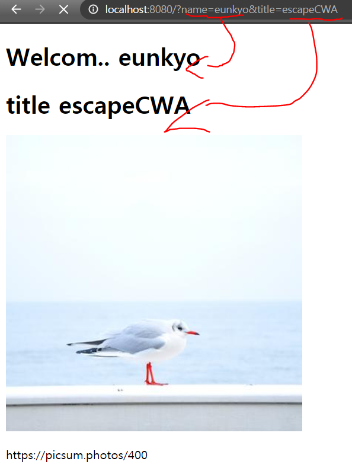

## Get, Post 
웹에서는 서버를 요청하는 방식에는 7가지 방식(method)이 있습니다. 그중에 가장 많이 사용하는 방식은 Get과 Post 방식입니다. 
 조금 더 이해를 돕자면 서버에 페이지를 달라고 요청할때 어떤 정보를 원하는지 좀 더 구체적으로 이야기 해준다면 서버는 좀 더 다양하고 사용자의 입맛에 맞는 페이지를 제공할 수 있습니다. 
그 제공하는 방식이 7가지로 알고있는데 더 있을수도 있어요...

그 중 오늘 해볼것은 Http 패키지를 이용하여 Get 방식(method)을 같이 해보겠습니다.  

코드가 조금 길어서 .. 여기 주소로.. 
[https://github.com/SeoEunkyo/nodejs_sturdy/blob/master/day04/index.js](https://github.com/SeoEunkyo/nodejs_sturdy/blob/master/day04/index.js)

코드를 카피해서 실행 시켜봅니다. 
[http://localhost:8080/](http://localhost:8080/)를 실행시키면 아래와 같이 나오고

[http://localhost:8080/?name=eunkyo&title=escapeCWA](http://localhost:8080/?name=eunkyo&title=escapeCWA)와 같은 주소로 실행시키면

이렇게 나옵니다. 변화가 느껴지죠 ?  맞습니다. 호출하는 URL 뒤에 이렇게 물은표(?)를 붙이고 원하는 파라미터를 넣어준다면 서버에게 전달할수 있습니다. 

--------
To do.. 
1. 우선 제가 작성한(기존에 작성한것 사용가능) res.end(...) 부분을 파일 형식으로 바꿔주세요. (파라미터가 전달되어서 페이지에 찍히는것 테스트)
2.  name과 title을 받는 새로운 페이지를 작성하여 submit 버튼을 누르게 된다면  이름 타이틀을 받아서 홈화면(/) 화면에 이름과 타이틀을 변경해 봅니다. 

